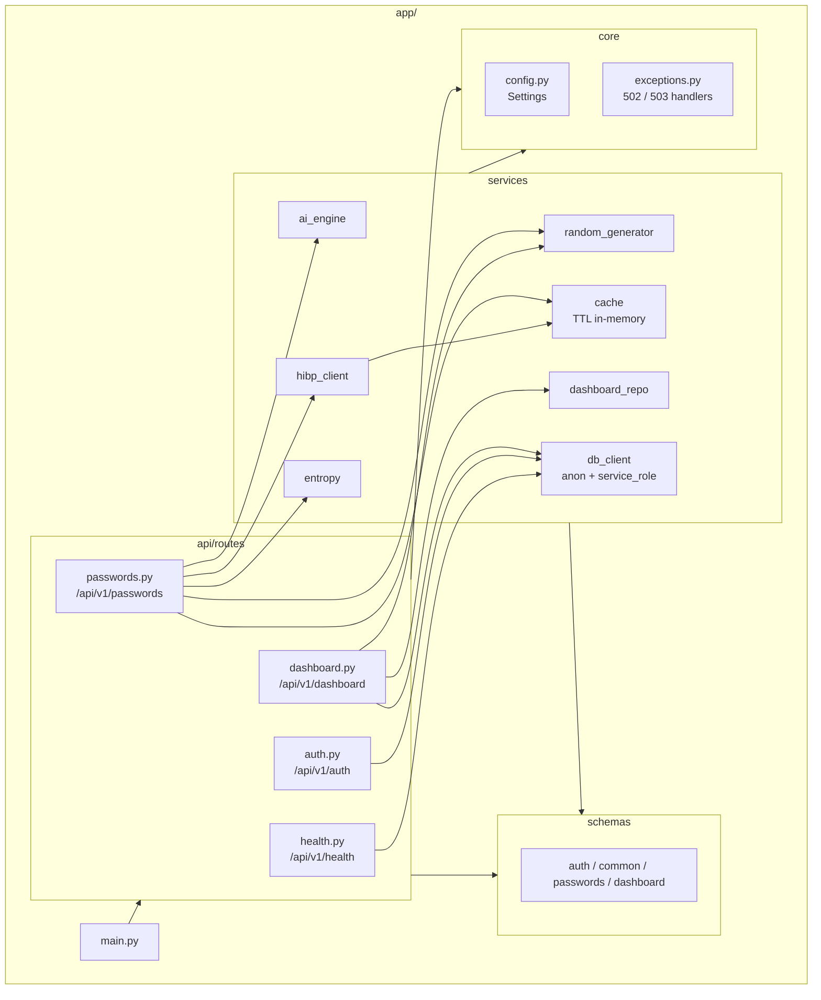
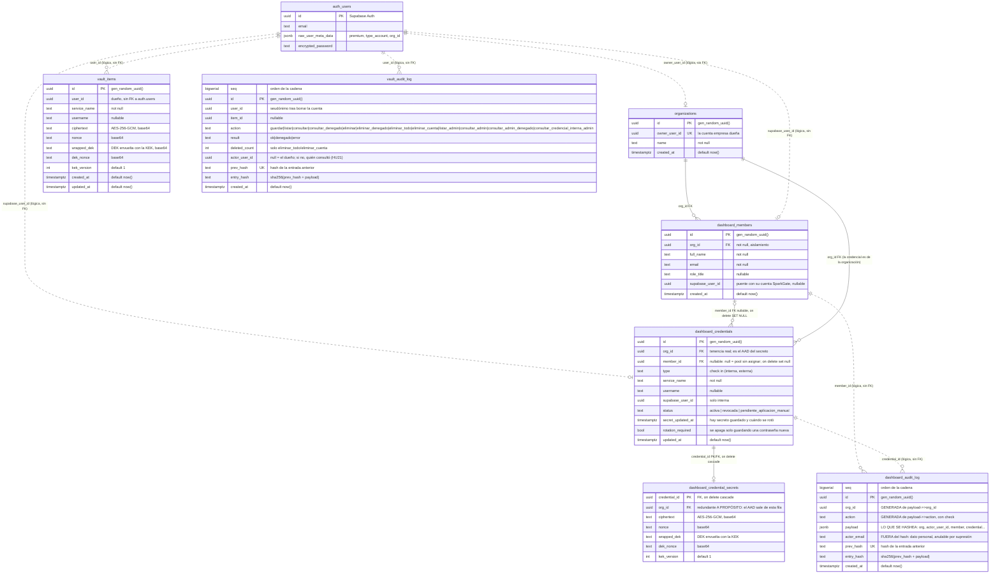
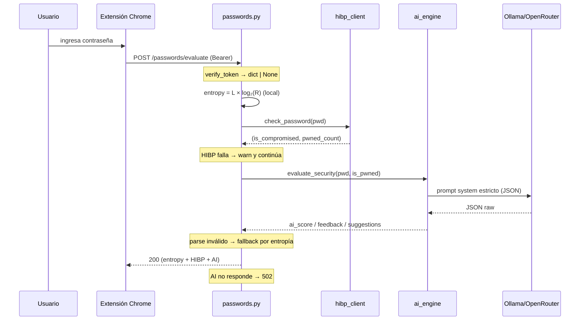
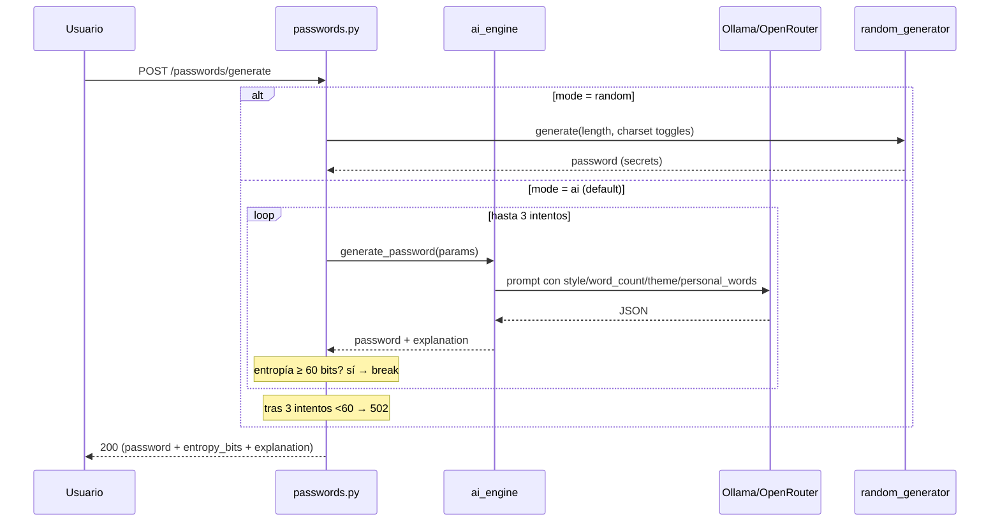
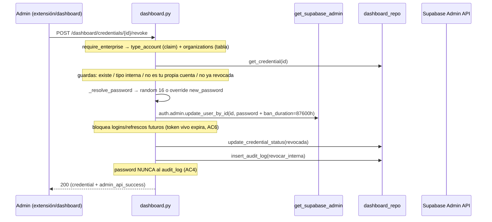
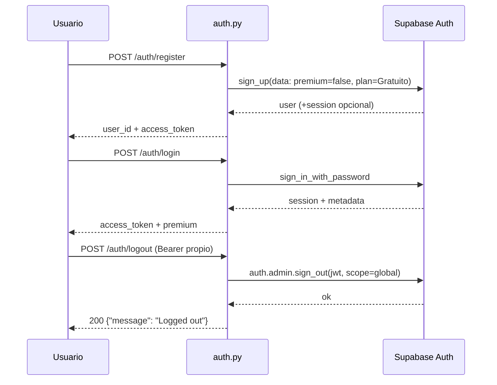
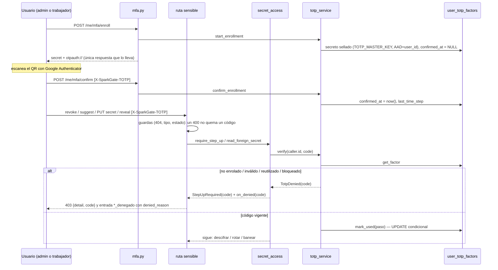
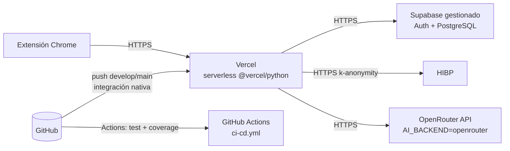

# Arquitectura de SparkGate API

> Documento vivo de arquitectura del backend. Refleja el estado actual del código
> en `app/`. Cualquier cambio de capas, contratos o modelo de datos debe reflejarse
> aquí (ver `AGENTS.md`).

SparkGate API es el backend REST que alimenta a la extensión de Chrome SparkGate.
Genera y evalúa contraseñas combinando tres dimensiones — complejidad matemática
(entropía), análisis semántico (LLM) y filtraciones conocidas (HIBP) — y expone un
panel de offboarding (SP-1) para que una PYME administre las credenciales de su
personal.

## 1. Visión general y stack

| Componente | Tecnología | Rol |
|------------|------------|-----|
| Lenguaje | Python 3.12+ | Runtime |
| Framework | FastAPI + Uvicorn | API REST, routers, OpenAPI en `/docs` |
| Validación | Pydantic v2 (`pydantic-settings`) | Schemas request/response + configuración |
| HTTP async | `httpx` | Clientes a Ollama, OpenRouter y HIBP |
| Auth + BD | Supabase (`supabase` py client) | Auth gestionada (`auth.users`) + PostgreSQL para el dashboard |
| LLM local | Llama 3.2 3B vía Ollama | Análisis/generación semántica (`AI_BACKEND=ollama`) |
| LLM cloud | OpenRouter API (`meta-llama/llama-3.1-8b-instruct`) | Alternativa al local (`AI_BACKEND=openrouter`) |
| Filtraciones | HIBP `api.pwnedpasswords.com` | Verificación k-anonymity |

El backend se configura por variables de entorno vía `.env` → `app/core/config.py`
(singleton `settings`). Ejemplo en `.env.example`.

## 2. Diagrama de contexto

```mermaid
flowchart LR
    U[Usuario] -->|usa| EXT[Extensión Chrome<br/>repo separado]
    EXT -->|HTTPS /api/v1/*| API[SparkGate API<br/>FastAPI en Vercel]
    API -->|Auth: sign_up / sign_in / sign_out| SA[Supabase Auth<br/>auth.users]
    API -->|CRUD service_role| PGB[(Supabase PostgreSQL<br/>dashboard_*)]
    API -->|/api/generate o chat/completions| LLM{Ollama local o OpenRouter}
    API -->|/range/{sha1-prefix} k-anonymity| HIBP[Have I Been Pwned]
```

## 3. Arquitectura por capas

Regla de dependencia **obligatoria**: las rutas (`api/routes/`) coordinan y llaman a
los servicios (`services/`); los servicios nunca importan rutas. `core/` (config +
excepciones) y `schemas/` son transversales y no dependen de capas superiores.


`app/main.py` es la composición raíz: registra los 4 routers, configura CORS (los
orígenes pueden incluir wildcards `chrome-extension://*` → se traducen a regex) y
conecta los handlers de `core/exceptions.py`.

## 4. Diagrama de componentes



### 4.1 Mapa módulo → responsabilidad

| Módulo | Archivo | Responsabilidad |
|--------|---------|-----------------|
| `main` | `app/main.py` | Instancia FastAPI, CORS, routers, handlers de excepción |
| Dependencias | `app/api/dependencies.py` | `verify_token` (JWT→dict o `None`), `require_premium`, `require_enterprise` |
| Auth | `app/api/routes/auth.py` | Proxy a Supabase Auth: register / login / logout |
| Passwords | `app/api/routes/passwords.py` | Evaluar (3 dimensiones) y generar (AI/random) |
| Dashboard | `app/api/routes/dashboard.py` | Offboarding SP-1: members, audit-log, revoke/suggest/restore |
| Vault | `app/api/routes/vault.py` | HU17: guardar/listar/consultar/eliminar credencial propia cifrada |
| MFA | `app/api/routes/mfa.py` | HU18: enrolar / confirmar / desactivar el segundo factor TOTP (`/me/mfa`, `require_user`) |
| Health | `app/api/routes/health.py` | Estado de Ollama (raíz) + sesión Supabase |
| `ai_engine` | `app/services/ai_engine.py` | Prompts + llamada LLM + parseo JSON (Ollama/OpenRouter) |
| `hibp_client` | `app/services/hibp_client.py` | SHA-1 truncado + consulta `/range/{prefix}` (caché por prefijo, TTL 24h) |
| `cache` | `app/services/cache.py` | `TTLCache` thread-safe sin dependencias; caches evaluate (TTL 1h) y HIBP |
| `entropy` | `app/services/entropy.py` | `H = L × log₂(R)`, umbral 60 bits |
| `random_generator` | `app/services/random_generator.py` | Generación criptográfica (`secrets`) |
| `dashboard_repo` | `app/services/dashboard_repo.py` | CRUD sobre tablas del dashboard |
| `vault_repo` | `app/services/vault_repo.py` | CRUD sobre `vault_items` / `vault_audit_log`, siempre filtrado por `user_id` |
| `vault_crypto` | `app/services/vault_crypto.py` | Envelope encryption AES-256-GCM (DEK por ítem, KEK en `.env`), AAD=`user_id`. Acepta una clave alternativa (`key_b64`): el factor TOTP se sella con `TOTP_MASTER_KEY`, no con la KEK |
| `totp_service` | `app/services/totp_service.py` | HU18: segundo factor RFC 6238 — enrolar, confirmar, verificar (ventana ±1 paso, anti-replay, bloqueo), desactivar |
| `totp_repo` | `app/services/totp_repo.py` | `user_totp_factors`; `mark_used`/`confirm_factor` son UPDATE condicionales (anti-replay atómico) |
| `secret_access` | `app/services/secret_access.py` | Punto de paso único: `read_foreign_secret` (lecturas) y `require_step_up` (escrituras sensibles) entran por el mismo `_verify_step_up` |
| `password_factory` | `app/services/password_factory.py` | `generate_password_core`, compartida por `/passwords/generate` y la rotación del panel |
| `audit_chain` | `app/services/audit_chain.py` | Registro encadenado por hash SHA-256 (base de HU19) |
| `db_client` | `app/services/db_client.py` | Clientes Supabase perezosos: anon y service_role |
| Config | `app/core/config.py` | `Settings` desde `.env` |
| Excepciones | `app/core/exceptions.py` | Tipos 502/503 + `StepUpRequired` (403 con `code` de primer nivel) + handlers JSON |

### 4.2 Contrato de error

Todas las respuestas de error usan `{"detail": string}` (compatible con el esquema
`ErrorResponse` en `app/schemas/common.py`). Códigos usados en rutas: `400` (bad
request / credencial ya revocada / confirmación de correo incorrecta al borrar
cuenta), `401` (sin token, inválido, o contraseña incorrecta al re-autenticar),
`403` (premium / admin requeridos), `404` (credencial inexistente o ajena),
`409` (email ya registrado), `502` (servicio AI fuera de servicio / entropía
insuficiente tras reintentos / falla al borrar el usuario tras purgar sus
datos), `503` (módulo Vault sin clave maestra configurada, HU17 AC5).

## 5. Modelo de datos

La base vive en Supabase (PostgreSQL). Se distinguen dos zonas:

- **`auth.users`** — gestionada por Supabase Auth. SparkGate no la lee ni escribe
  directo: la manipula vía API (`sign_up`, `sign_in_with_password`,
  `auth.admin.update_user_by_id`, `auth.admin.sign_out`). Los flags de negocio se
  guardan en `raw_user_meta_data` → `premium`, `type_account` y `org_id`. Los dos
  últimos son **cache de gateo**: la fuente de verdad de la organización es la tabla
  `organizations` (ver §7).
- **Tablas `organizations` y `dashboard_*`** — creadas por `sql/dashboard_schema.sql`,
  accesibles solo desde el backend con la clave `service_role` (RLS activado sin policies, deny-all para `anon`; el gateo es
  aplicación-side con `require_enterprise`, y el aislamiento entre empresas es un
  `.eq("org_id", ...)` en cada consulta de `dashboard_repo.py`).
- **Tablas `vault_*`** — creadas por `sql/vault_schema.sql`, mismo modelo de acceso
  (`service_role`, RLS deny-all), pero gateado por `require_user` y un `.eq("user_id", ...)`
  aplicado en cada consulta de `vault_repo.py`, no por rol.



**Observaciones de diseño** (decisiones explícitas, no omisiones):

- Las credenciales *internas* referencian a `auth.users` mediante `supabase_user_id`.
  No hay FK real porque `auth.users` pertenece al esquema `auth` de Supabase.
- Desde HU21 la correspondencia miembro ↔ usuario auth es explícita:
  `dashboard_members.supabase_user_id`. Es el puente que la empresa usa para abrir
  la bóveda del trabajador, y lo único que se anula (sin borrar la fila) cuando el
  integrante ejerce su derecho de supresión. Sigue sin haber FK real a `auth.users`,
  que pertenece a otro esquema.
- `dashboard_audit_log` **nunca** almacena contraseñas (AC4): guarda actor, miembro,
  credencial y acción, no valores.
- Índices: `dashboard_members(org_id)`, `dashboard_credentials(member_id)`,
  `dashboard_audit_log(org_id)` y `dashboard_audit_log(created_at desc)`.
- RLS activado **sin policies** (deny-all) en las seis tablas: la clave `anon`, pública por
  diseño, no ve ni escribe nada por PostgREST. El acceso es exclusivo vía `service_role`
  (cliente `get_supabase_admin()`), que ignora RLS, y ese cliente nunca se expone a callers
  no-admin. No hay policies por usuario porque ningún cliente se conecta a estas tablas con un
  JWT de usuario.
- `vault_items` nunca guarda el secreto en claro: solo el sobre cifrado
  (`ciphertext`/`nonce`/`wrapped_dek`/`dek_nonce`). El AAD del cifrado es el
  `user_id`, así que mover una fila a otro dueño rompe el tag GCM aunque se
  conozca la KEK (HU17 AC2/AC3).
- `vault_audit_log` es una cadena hash (HU19): cada `entry_hash` cubre
  `prev_hash` + el payload. El payload es **seudónimo a propósito** (solo
  UUIDs y enums, nunca `service_name` ni secretos) para que borrar una cuenta
  (Ley 21.719) nunca obligue a romper la cadena — el `user_id` simplemente
  deja de mapear a una persona real. `prev_hash` es `unique`: dos escrituras
  concurrentes sobre la misma cola fallan la segunda en vez de bifurcar la
  cadena en silencio.
- Índices: `vault_items(user_id)` y `vault_audit_log(user_id)`.
- `user_totp_factors` (HU18): una fila por persona. El sobre cifrado del secreto TOTP viaja ENTERO en la columna jsonb `secret_envelope` (sellado con `TOTP_MASTER_KEY`, AAD = ese mismo `user_id`), así que ningún módulo nuevo nombra las columnas del criptograma de la bóveda. `confirmed_at` nulo = enrolamiento a medias, que NO habilita nada. `last_time_step` es el contador anti-replay; `failed_attempts`/`locked_until`, el freno de fuerza bruta. RLS deny-all como las demás. Se aplica con `sql/mfa_schema.sql` (aditivo: solo cambian CHECKs de las dos tablas de auditoría, no columnas, así que ninguna cadena se invalida).
- El ciclo de vida del factor (`mfa_enrolar`/`activar`/`desactivar`/`denegado`) se audita en `vault_audit_log` y no en `dashboard_audit_log`: es de la persona, una cuenta personal no tiene `org_id`, y además el propio usuario lo ve en `GET /vault/audit`. El motivo de una denegación del panel (`denied_reason`, siempre un enum) va en el payload jsonb.

## 6. Flujos clave

### 6.1 Evaluar contraseña — `POST /api/v1/passwords/evaluate`



Tolerancia a fallos: la dimensión de entropía siempre se entrega; HIBP caído se
degrada a "no comprometida" con log; IA caída responde `502` informando que el
análisis matemático sí se completó.

### 6.2 Generar contraseña — `POST /api/v1/passwords/generate`



### 6.3 Offboarding — revocar credencial interna (SP-1)



Variantes: **suggest** solo aplica a credenciales *externas* (estado →
`pendiente_aplicacion_manual`); **restore** desbanea (`ban_duration: "none"`) y
vuelve a `activa` en interna o externa.

### 6.4 Sesión — registro / login / logout



Logout revoca la sesión del **propio** token presentado (scope global). No es
posible revocar la sesión de otro usuario desde aquí: el offboarding de quien se va
se hace por el panel (ban + rotación de contraseña).

### 6.5 Segundo factor — enrolar y verificar (HU18)



El código viaja en el header, no en el body ni en la URL. Un código aceptado no se puede reusar (RFC 6238 §5.2): dos
peticiones simultáneas con el mismo código leen el mismo `last_time_step`, pero solo una gana el UPDATE condicional.
Consecuencia de producto, no un defecto: **una operación sensible por cada paso de 30 s**.

## 7. Invariantes de seguridad (aplicados en código)

| Invariante | Dónde | Evidencia |
|------------|-------|-----------|
| HIBP nunca recibe la contraseña | `hibp_client.py` | SHA-1 local; solo prefijo de 5 hex a `/range/{prefix}` |
| Cabecera anti-seguimiento HIBP | `hibp_client.py` | `Add-Padding: true` |
| Contraseñas ≥ 60 bits de entropía | `entropy.py`, `passwords.py` | Umbral `MIN_ENTROPY_BITS = 60`; AI reintenta hasta 3× |
| Generación criptográfica | `random_generator.py` | `secrets` + `SystemRandom().shuffle` |
| LLM responde JSON estructurado | `ai_engine.py` | `format: "json"` (Ollama) / `response_format` (OpenRouter) |
| Parse defensivo de IA | `ai_engine.py` | cadena directo → regex → reparo → fallback entropía |
| Tokens de servicio nunca al cliente | `db_client.py`, `dependencies.py` | `get_supabase_admin()` solo en paths admin |
| Guardas de offboarding | `dashboard.py` | no revocar propia cuenta admin; solo interna |
| Sin contraseñas en el audit log | `dashboard.py`, `dashboard_repo.py` | AC4 — solo actor/acción |
| CORS por orígenes exactos + regex | `main.py` | wildcards traducidos a regex |
| Envelope encryption (DEK/KEK) | `vault_crypto.py` | AES-256-GCM, KEK en `.env`, nunca en DB ni logs (HU17 AC2) |
| Ciphertext ligado al sujeto dueño | `vault_crypto.py`, `secret_access.py` | AAD = id del **sujeto dueño** leído de la MISMA fila que el criptograma: `user_id` de una persona o `org_id` de la organización. Nunca el del caller |
| Fallo de integridad visible, no silencioso | `vault.py`, `dashboard.py` | `InvalidTag` → 503 + auditoría `result="error"`; nunca 404 (escondería la adulteración) ni 500 |
| Aislamiento entre organizaciones | `dashboard_repo.py`, `dependencies.py` | `.eq("org_id", ...)` en cada consulta; el `org_id` lo resuelve `require_enterprise` contra la tabla `organizations`, nunca desde el claim del token (HU21 AC3) |
| El claim de tenencia solo puede negar | `dependencies.py` | `user_metadata.org_id` se aplana como `claimed_org_id`; la clave `org_id` que leen los handlers la escribe únicamente el guard tras consultar la tabla |
| Toda lectura de un secreto ajeno pasa por un único punto | `secret_access.py` | `read_foreign_secret`: KEK → segundo factor TOTP (RFC 6238, anti-replay) → descifrado. Tests herméticos: ninguna ruta descifra por su cuenta, y `totp_service.verify` y `_verify_step_up` solo aparecen en `secret_access.py` |
| Toda ESCRITURA sensible pasa por el mismo verificador | `secret_access.py`, `dashboard.py` | `require_step_up` en revoke, suggest y `PUT /secret`: después de las guardas y antes de cualquier efecto, así un 400 no quema un código y un rechazo no deja la cuenta a medio rotar |
| Un rechazo del segundo factor no accede, no cambia nada y deja rastro | `dashboard.py`, `me.py` | HU18 AC4. `*_denegado` con `denied_reason` (siempre un enum: el repositorio lo exige); E2E pasos 1-3, 16, 19, 25, 27 |
| Un factor sin confirmar no habilita nada | `totp_service.py` | `confirmed_at` nulo ⇒ `totp_no_enrolado`. Sin esto, abandonar el enrolamiento dejaría a la persona sin salida (E2E paso 7) |
| Un código no se reusa | `totp_service.py`, `totp_repo.py` | dos capas: chequeo `<= last_time_step` y UPDATE condicional. Cada capa tiene su propio test: la segunda tapaba a la primera (E2E paso 13) |
| El factor no depende de la KEK de la bóveda | `vault_crypto.py`, `totp_service.py` | sellado con `TOTP_MASTER_KEY`. Por eso «revocar a alguien no depende de la KEK» sigue siendo cierto con el segundo factor puesto. Sin `TOTP_MASTER_KEY`: 503, nunca se omite el factor |
| Ningún secreto TOTP ni código llega a un log ni a una auditoría | `totp_service.py`, `mfa.py`, `dashboard_repo.py` | probado por recorrido con la cadena real y por mutación; E2E paso 34 |
| Una sesión revocada deja de servir en la petición siguiente | `dependencies.py` (`verify_token`) | **MEDIDO contra Supabase real**: `hu18-e2e.txt` pasos 22-24 y `hu21-e2e.txt` 21b0. Access token → 401; login con la contraseña vieja y la nueva → `user_banned`; refresh token previo → `refresh_token_not_found`. **Depende de que `verify_token` consulte a Auth en CADA request y no valide el JWT localmente: si alguien pasa a validación local, esta fila deja de ser cierta y hay que rehacer la medición.** La limitación de JWT (un token puede seguir válido hasta su `exp`, ~1 h) existe para un tercero que lo valide por su cuenta, y queda documentada, no oculta |
| El criptograma solo lo nombran dos módulos | `credential_secret_repo.py`, `vault_crypto.py` | test hermético sobre el código fuente; los listados usan columnas explícitas, nunca `select("*")` |
| La credencial es de la organización y sobrevive al integrante | `sql/dashboard_schema.sql` | `member_id` nullable + `ON DELETE SET NULL`; el secreto no depende de `supabase_user_id` |
| El log de la organización es una cadena verificable | `audit_chain.py` | payload jsonb hasheado; `actor_email` fuera del hash; `append_entry` reintenta ante colisión de `prev_hash` |
| El borrado de cuenta no retiene la contraseña de una cuenta que ya no existe | `dashboard_repo.py` | `detach_supabase_user` borra el sobre de las internas ANTES de cortar el vínculo |
| Ninguna contraseña llega a ningún payload de auditoría | `dashboard.py`, `me.py` | las contraseñas SÍ se persisten (cifradas) pero nunca a los logs; probado por mutación |
| Recurso de otra organización → 404 | `dashboard.py` | integrante y credencial ajenos responden igual que los inexistentes, nunca 403 |
| Toda lectura de bóveda ajena queda doblemente registrada | `dashboard.py` | `vault_audit_log` con `actor_user_id` (lo ve **el trabajador**) + `dashboard_audit_log` (lo ve la empresa) — HU21 AC7 |
| Vault rechaza sin KEK, sin persistir en claro | `vault.py` | `is_available()` chequeado antes de cualquier escritura (AC5) |
| Ownership explícito en la aplicación | `vault_repo.py` | `.eq("user_id", ...)` en cada lectura/borrado del vault; RLS no lo reemplaza, porque el backend usa `service_role` |
| Sin acceso directo con la clave pública | `sql/*.sql` | RLS activado sin policies en las seis tablas: con la clave `anon` no se lee ni se altera nada, incluida la cadena de auditoría |
| Enumeración de IDs ajenos evitada | `vault.py` | ítem inexistente y ajeno responden ambos 404, nunca 403 |
| Auditoría del vault sin secretos ni service_name | `vault.py`, `audit_chain.py` | payload seudónimo: solo UUIDs y enums (AC4, HU19) |
| Cadena de auditoría detecta alteración | `audit_chain.py` | `entry_hash = sha256(prev_hash + payload)`, `verify_chain` recalcula todo |
| Borrado nunca depende de la KEK | `vault.py` | DELETE de ítem/purga funciona con `is_available() == False` (Ley 21.719) |
| Borrado de cuenta con doble confirmación | `auth.py` | correo exacto (400) + contraseña re-autenticada (401) antes de borrar nada |
| Borrado de cuenta no deja datos huérfanos | `auth.py` | orden: purgar vault → registrar auditoría → desasociar dashboard → `delete_user` al final |

## 8. Vista de despliegue



- Arranque local: `./start.sh` (venv → deps → chequeo Ollama → uvicorn `:8000`);
  `./stop.sh` lo detiene. Doc interactivo en `http://localhost:8000/docs`.
- Config de despliegue Vercel en `vercel.json` (`@vercel/python`, fuerza
  `AI_BACKEND=openrouter` vía `env` — serverless no puede correr Ollama local).
  Deploy automático por la integración nativa de GitHub de Vercel (preview por
  push/PR, producción en `main`); `.github/workflows/ci-cd.yml` solo corre
  tests + coverage, no dispara el deploy.
- Local sigue usando Ollama por default (`AI_BACKEND=ollama`, alcance
  académico); en Vercel es exclusivamente OpenRouter porque no hay proceso
  local persistente donde correr el LLM. Migrar de un backend a otro es solo
  cambiar `AI_BACKEND`/`OPENROUTER_API_KEY` en `.env`, sin tocar código
  (routing en `ai_engine._call_ai`).
- Inferencia local: GPU NVIDIA (CUDA) con `num_ctx` coherente (1024) entre
  peticiones — Ollama recompila si cambia el contexto (~5s). Latencia con
  GPU+tuning+caché: evaluate cold ~2.8s / cached ~1ms / generate ~1.6s
  (detalle en `docs/evidencia/comparativa-rendimiento.md`).
- Caché evaluate: key incluye `AI_EVALUATE_VERSION` (`ai_engine.py`) para
  invalidar al cambiar prompts; `generate` nunca se cachea (riesgo de reuso).
- Seed del panel SP-1: `python scripts/seed_dashboard_demo.py` (idempotente,
  requiere `SUPABASE_SERVICE_ROLE_KEY`).
- Esquema del vault (HU17): `python scripts/apply_vault_schema.py` — aplica
  `sql/vault_schema.sql` vía `SUPABASE_DB_URL` si está configurada (conexión
  directa con `psycopg`), o imprime el SQL para pegar a mano en el editor de
  Supabase si no. Idempotente, verifica al final contra la API real.
- Verificación E2E del vault (HU17): `python scripts/e2e_vault_check.py`
  contra el backend levantado y Supabase real (no mocks) — crea dos cuentas
  descartables vía Admin API, guarda/consulta/audita/borra, y comprueba
  `verify_chain`. `E2E_ALLOW_ACCOUNT_DELETE=1` suma el flujo de borrado de
  cuenta. Evidencia en `docs/evidencia/hu17-e2e.txt`.

## 9. Catálogo de endpoints (mapeo real)

| Método | Ruta | Guarda | Capa servicio | Notas |
|--------|------|--------|---------------|-------|
| GET | `/api/v1/health` | — | `db_client.check_connection` + GET Ollama raíz | estado `ok`/`degraded` |
| POST | `/api/v1/auth/register` | — | Supabase `sign_up` + `org_repo` | `type_account` viaja en el `sign_up`; si es `enterprise`, crea la organización |
| POST | `/api/v1/auth/login` | — | Supabase `sign_in_with_password` | devuelve `access_token` |
| POST | `/api/v1/auth/logout` | Bearer propio | `admin.sign_out(scope=global)` | solo propia sesión |
| POST | `/api/v1/passwords/evaluate` | auth | `entropy` + `hibp_client` + `ai_engine` (con caché `cache.py`, TTL 1h) | 3 dimensiones |
| POST | `/api/v1/passwords/generate` | auth | `random_generator` / `ai_engine` | `mode: ai\|random` |
| GET | `/api/v1/dashboard/members` | empresa | `dashboard_repo` | miembros + credenciales de **su** organización |
| POST | `/api/v1/dashboard/members` | empresa | `dashboard_repo` + Admin API | alta de trabajador; devuelve la contraseña temporal una sola vez (HU21 AC2) |
| GET | `/api/v1/dashboard/audit-log` | empresa | `dashboard_repo` | `created_at desc`, filtrado por `org_id` |
| POST | `/api/v1/dashboard/credentials/{id}/revoke` | empresa + **TOTP** | `secret_access` + `dashboard_repo` + Admin API | interna (HU18 AC2): rota la contraseña y banea en UNA llamada a `update_user_by_id`; `sign_out` no sirve (revoca por el JWT de la sesión, que el admin no tiene) |
| POST | `/api/v1/dashboard/credentials/{id}/suggest` | empresa + **TOTP** | `secret_access` + `dashboard_repo` | externa (HU18 AC3): queda `pendiente_aplicacion_manual`. `admin_api_success=true` significa «el backend hizo lo suyo», NO «el proveedor cambió la contraseña» |
| POST | `/api/v1/dashboard/credentials/{id}/restore` | empresa | `dashboard_repo` + Admin API | interna/externa |
| GET | `/api/v1/dashboard/members/{id}/vault` | empresa | `dashboard_repo` + `vault_repo` | metadata del trabajador, no descifra; sin cuenta vinculada → `[]` (HU21 AC5) |
| POST | `/api/v1/dashboard/members/{id}/vault/{item}/reveal` | empresa + **TOTP** | `secret_access` | descifra con el AAD del **dueño**; doble auditoría (HU21 AC6/AC7) |
| GET | `/api/v1/dashboard/credentials` | empresa | `dashboard_repo` | `?assigned=false` = pool sin asignar (etapa C) |
| POST | `/api/v1/dashboard/credentials` | empresa | `dashboard_repo` + `secret_access` | registra una cuenta externa; contraseña opcional, cifrada con AAD = org |
| PUT | `/api/v1/dashboard/credentials/{id}/secret` | empresa + **TOTP** | `secret_access` + `credential_secret_repo` | guarda/reemplaza; nunca devuelve el plaintext; `apply_to_account` (interna) va primero a Auth |
| POST | `/api/v1/dashboard/credentials/{id}/secret/reveal` | empresa + **TOTP** | `secret_access` | POST a propósito; interna ⇒ además entrada en la auditoría del trabajador |
| POST | `/api/v1/dashboard/credentials/{id}/reassign` | empresa | `dashboard_repo` | solo externas; no re-cifra; sugiere rotar la que cambia de manos |
| GET | `/api/v1/me/credentials` | usuario | `dashboard_repo` | lo que la empresa le asignó al trabajador (router propio, `require_user`) |
| POST | `/api/v1/me/credentials/{id}/reveal` | usuario + **TOTP** | `secret_access` | el trabajador retira su credencial; también exige el factor (el secreto es de la ORGANIZACIÓN); 403 si su cuenta interna está revocada |
| GET | `/api/v1/me/mfa` | usuario | `totp_service` | estado del factor; nunca el secreto |
| POST | `/api/v1/me/mfa/enroll` | usuario | `totp_service` | 201; única respuesta con el secreto (`otpauth_uri` para el QR, dibujado por el cliente); 409 si ya hay uno confirmado; 503 sin `TOTP_MASTER_KEY` |
| POST | `/api/v1/me/mfa/confirm` | usuario + código | `totp_service` | el primer código correcto activa el factor |
| DELETE | `/api/v1/me/mfa` | usuario + código | `totp_service` | exige un código vigente: un JWT robado no puede apagar el factor |
| POST | `/api/v1/vault/items` | usuario | `vault_crypto` + `vault_repo` | 503 si falta la KEK (AC5) |
| GET | `/api/v1/vault/items` | usuario | `vault_repo` | metadatos, nunca descifra |
| GET | `/api/v1/vault/items/{id}` | usuario | `vault_repo` + `vault_crypto` | 404 si no es del dueño (AC3) |
| DELETE | `/api/v1/vault/items/{id}` | usuario | `vault_repo` | no exige KEK (Ley 21.719) |
| DELETE | `/api/v1/vault/items` | usuario | `vault_repo` | purga total, `deleted_count` |
| GET | `/api/v1/vault/audit` | usuario | `vault_repo` | propio, base de HU19 |
| DELETE | `/api/v1/auth/account` | usuario | `vault_repo` + `dashboard_repo` + Admin API | irreversible, confirma correo + password |

## 10. Estructura de directorios

```
app/
├── main.py                 # Ensamblado FastAPI: CORS, routers, exception handlers
├── api/
│   ├── dependencies.py     # verify_token / require_user / require_premium / require_enterprise
│   └── routes/             # Coordinadores (auth, passwords, dashboard, vault, health)
├── core/                   # config.py (Settings) + exceptions.py (handlers 502/503)
├── schemas/                # Pydantic: auth, common, passwords, dashboard, vault
└── services/               # Todo I/O: ai_engine, hibp_client, entropy, cache,
                            #   random_generator, dashboard_repo, vault_repo,
                            #   vault_crypto, audit_chain, db_client
sql/dashboard_schema.sql    # DDL del panel de offboarding
sql/vault_schema.sql        # DDL del vault (HU17) + auditoría encadenada (HU19)
scripts/seed_dashboard_demo.py
scripts/apply_vault_schema.py   # aplica sql/vault_schema.sql (psycopg o instrucciones manuales)
scripts/e2e_vault_check.py      # verificación E2E del vault contra backend + Supabase reales
tests/                      # Ver suite en AGENTS.md
```
