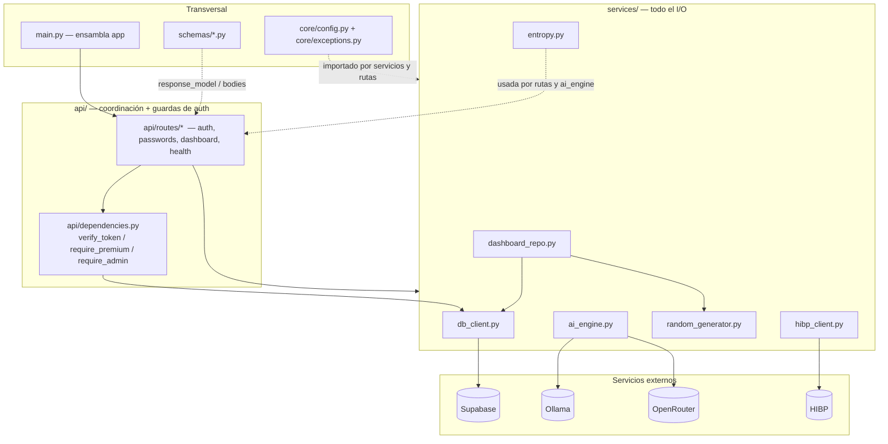
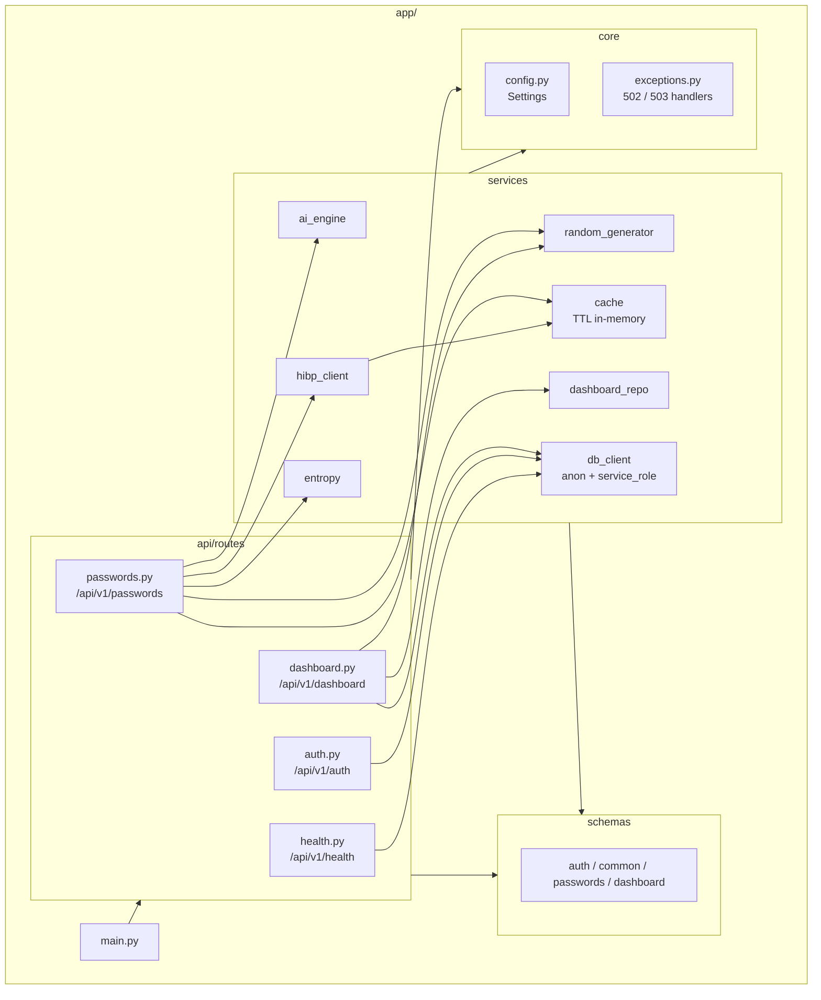
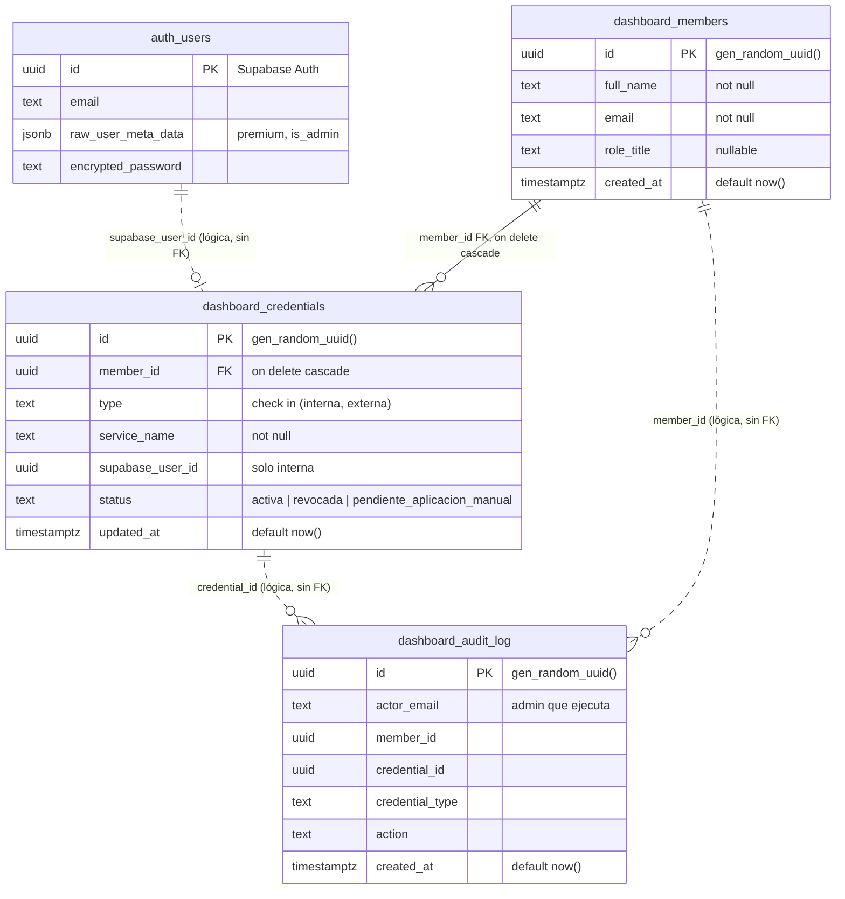
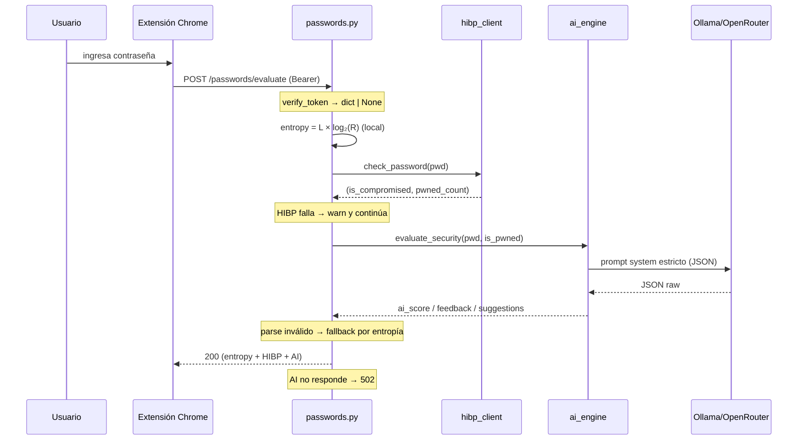
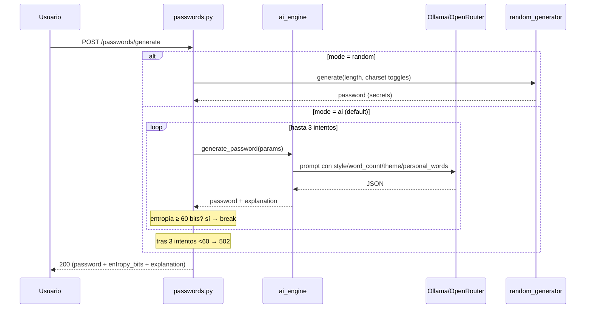
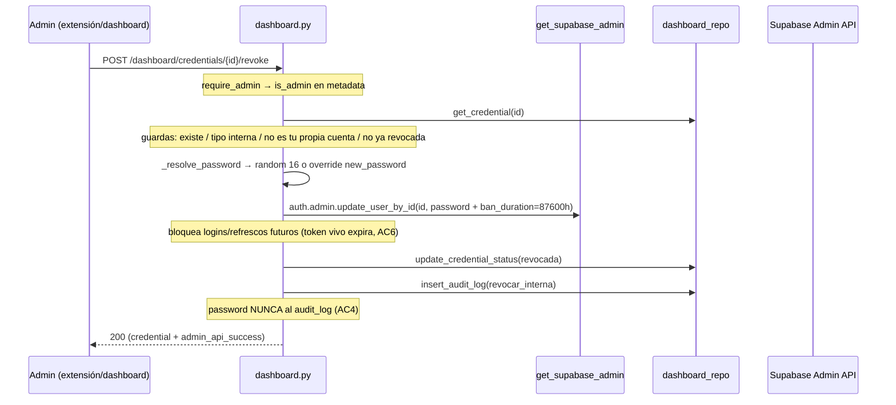
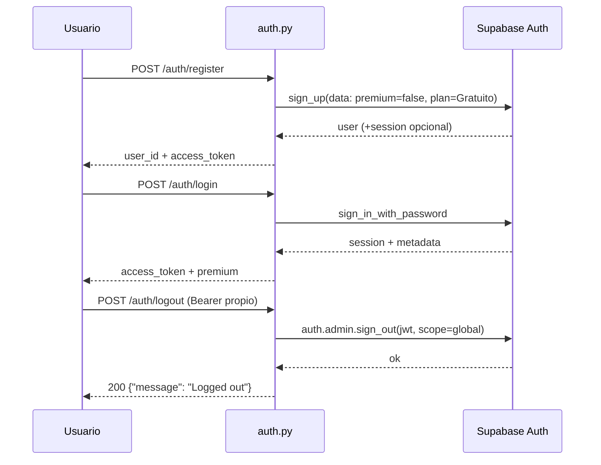
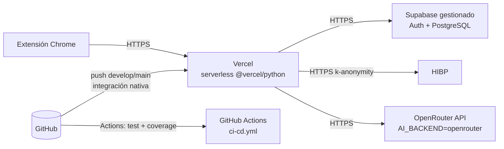

# Arquitectura de SparkGate API

> Documento vivo de arquitectura del backend. Refleja el estado actual del código
> en `app/`. Cualquier cambio de capas, contratos o modelo de datos debe reflejarse
> aquí (ver `AGENTS.md`).

SparkGate API es el backend REST que alimenta a la extensión de Chrome SparkGate.
Genera y evalúa contraseñas combinando tres dimensiones — complejidad matemática
(entropía), análisis semántico (LLM) y filtraciones conocidas (HIBP) — y expone un
panel de offboarding (SP-1) para que una PYME administre las credenciales de su
personal.

## 1. Visión general y stack

| Componente | Tecnología | Rol |
|------------|------------|-----|
| Lenguaje | Python 3.12+ | Runtime |
| Framework | FastAPI + Uvicorn | API REST, routers, OpenAPI en `/docs` |
| Validación | Pydantic v2 (`pydantic-settings`) | Schemas request/response + configuración |
| HTTP async | `httpx` | Clientes a Ollama, OpenRouter y HIBP |
| Auth + BD | Supabase (`supabase` py client) | Auth gestionada (`auth.users`) + PostgreSQL para el dashboard |
| LLM local | Llama 3.2 3B vía Ollama | Análisis/generación semántica (`AI_BACKEND=ollama`) |
| LLM cloud | OpenRouter API (`meta-llama/llama-3.1-8b-instruct`) | Alternativa al local (`AI_BACKEND=openrouter`) |
| Filtraciones | HIBP `api.pwnedpasswords.com` | Verificación k-anonymity |

El backend se configura por variables de entorno vía `.env` → `app/core/config.py`
(singleton `settings`). Ejemplo en `.env.example`.

## 2. Diagrama de contexto

```mermaid
flowchart LR
    U[Usuario] -->|usa| EXT[Extensión Chrome<br/>repo separado]
    EXT -->|HTTPS /api/v1/*| API[SparkGate API<br/>FastAPI en Vercel]
    API -->|Auth: sign_up / sign_in / sign_out| SA[Supabase Auth<br/>auth.users]
    API -->|CRUD service_role| PGB[(Supabase PostgreSQL<br/>dashboard_*)]
    API -->|/api/generate o chat/completions| LLM{Ollama local o OpenRouter}
    API -->|/range/{sha1-prefix} k-anonymity| HIBP[Have I Been Pwned]
```

## 3. Arquitectura por capas

Regla de dependencia **obligatoria**: las rutas (`api/routes/`) coordinan y llaman a
los servicios (`services/`); los servicios nunca importan rutas. `core/` (config +
excepciones) y `schemas/` son transversales y no dependen de capas superiores.



`app/main.py` es la composición raíz: registra los 4 routers, configura CORS (los
orígenes pueden incluir wildcards `chrome-extension://*` → se traducen a regex) y
conecta los handlers de `core/exceptions.py`.

## 4. Diagrama de componentes



### 4.1 Mapa módulo → responsabilidad

| Módulo | Archivo | Responsabilidad |
|--------|---------|-----------------|
| `main` | `app/main.py` | Instancia FastAPI, CORS, routers, handlers de excepción |
| Dependencias | `app/api/dependencies.py` | `verify_token` (JWT→dict o `None`), `require_premium`, `require_admin` |
| Auth | `app/api/routes/auth.py` | Proxy a Supabase Auth: register / login / logout |
| Passwords | `app/api/routes/passwords.py` | Evaluar (3 dimensiones) y generar (AI/random) |
| Dashboard | `app/api/routes/dashboard.py` | Offboarding SP-1: members, audit-log, revoke/suggest/restore |
| Health | `app/api/routes/health.py` | Estado de Ollama (raíz) + sesión Supabase |
| `ai_engine` | `app/services/ai_engine.py` | Prompts + llamada LLM + parseo JSON (Ollama/OpenRouter) |
| `hibp_client` | `app/services/hibp_client.py` | SHA-1 truncado + consulta `/range/{prefix}` (caché por prefijo, TTL 24h) |
| `cache` | `app/services/cache.py` | `TTLCache` thread-safe sin dependencias; caches evaluate (TTL 1h) y HIBP |
| `entropy` | `app/services/entropy.py` | `H = L × log₂(R)`, umbral 60 bits |
| `random_generator` | `app/services/random_generator.py` | Generación criptográfica (`secrets`) |
| `dashboard_repo` | `app/services/dashboard_repo.py` | CRUD sobre tablas del dashboard |
| `db_client` | `app/services/db_client.py` | Clientes Supabase perezosos: anon y service_role |
| Config | `app/core/config.py` | `Settings` desde `.env` |
| Excepciones | `app/core/exceptions.py` | Tipos 502/503 + handlers JSON |

### 4.2 Contrato de error

Todas las respuestas de error usan `{"detail": string}` (compatible con el esquema
`ErrorResponse` en `app/schemas/common.py`). Códigos usados en rutas: `400` (bad
request / credencial ya revocada), `401` (sin token o inválido), `403` (premium /
admin requeridos), `404` (credencial inexistente), `409` (email ya registrado),
`502` (servicio AI fuera de servicio / entropía insuficiente tras reintentos).

## 5. Modelo de datos

La base vive en Supabase (PostgreSQL). Se distinguen dos zonas:

- **`auth.users`** — gestionada por Supabase Auth. SparkGate no la lee ni escribe
  directo: la manipula vía API (`sign_up`, `sign_in_with_password`,
  `auth.admin.update_user_by_id`, `auth.admin.sign_out`). Los flags de negocio se
  guardan en `raw_user_meta_data` → `premium` e `is_admin`.
- **Tablas `dashboard_*`** — creadas por `sql/dashboard_schema.sql`, accesibles solo
  desde el backend con la clave `service_role` (sin RLS; el gateo de admin es
  aplicación-side con `require_admin`).



**Observaciones de diseño** (decisiones explícitas, no omisiones):

- Las credenciales *internas* referencian a `auth.users` mediante `supabase_user_id`.
  No hay FK real porque `auth.users` pertenece al esquema `auth` de Supabase.
- La correspondencia miembro ↔ usuario auth es **por email** (así la establece
  `scripts/seed_dashboard_demo.py`). No existe FK `dashboard_members.user_id`.
- `dashboard_audit_log` **nunca** almacena contraseñas (AC4): guarda actor, miembro,
  credencial y acción, no valores.
- Índices: `dashboard_credentials(member_id)` y `dashboard_audit_log(created_at desc)`.
- Sin RLS: acceso exclusivo vía `service_role` (cliente `get_supabase_admin()`),
  nunca expuesto a callers no-admin.

## 6. Flujos clave

### 6.1 Evaluar contraseña — `POST /api/v1/passwords/evaluate`



Tolerancia a fallos: la dimensión de entropía siempre se entrega; HIBP caído se
degrada a "no comprometida" con log; IA caída responde `502` informando que el
análisis matemático sí se completó.

### 6.2 Generar contraseña — `POST /api/v1/passwords/generate`



### 6.3 Offboarding — revocar credencial interna (SP-1)



Variantes: **suggest** solo aplica a credenciales *externas* (estado →
`pendiente_aplicacion_manual`); **restore** desbanea (`ban_duration: "none"`) y
vuelve a `activa` en interna o externa.

### 6.4 Sesión — registro / login / logout



Logout revoca la sesión del **propio** token presentado (scope global). No es
posible revocar la sesión de otro usuario desde aquí: el offboarding de quien se va
se hace por el panel (ban + rotación de contraseña).

## 7. Invariantes de seguridad (aplicados en código)

| Invariante | Dónde | Evidencia |
|------------|-------|-----------|
| HIBP nunca recibe la contraseña | `hibp_client.py` | SHA-1 local; solo prefijo de 5 hex a `/range/{prefix}` |
| Cabecera anti-seguimiento HIBP | `hibp_client.py` | `Add-Padding: true` |
| Contraseñas ≥ 60 bits de entropía | `entropy.py`, `passwords.py` | Umbral `MIN_ENTROPY_BITS = 60`; AI reintenta hasta 3× |
| Generación criptográfica | `random_generator.py` | `secrets` + `SystemRandom().shuffle` |
| LLM responde JSON estructurado | `ai_engine.py` | `format: "json"` (Ollama) / `response_format` (OpenRouter) |
| Parse defensivo de IA | `ai_engine.py` | cadena directo → regex → reparo → fallback entropía |
| Tokens de servicio nunca al cliente | `db_client.py`, `dependencies.py` | `get_supabase_admin()` solo en paths admin |
| Guardas de offboarding | `dashboard.py` | no revocar propia cuenta admin; solo interna |
| Sin contraseñas en el audit log | `dashboard.py`, `dashboard_repo.py` | AC4 — solo actor/acción |
| CORS por orígenes exactos + regex | `main.py` | wildcards traducidos a regex |

## 8. Vista de despliegue



- Arranque local: `./start.sh` (venv → deps → chequeo Ollama → uvicorn `:8000`);
  `./stop.sh` lo detiene. Doc interactivo en `http://localhost:8000/docs`.
- Config de despliegue Vercel en `vercel.json` (`@vercel/python`, fuerza
  `AI_BACKEND=openrouter` vía `env` — serverless no puede correr Ollama local).
  Deploy automático por la integración nativa de GitHub de Vercel (preview por
  push/PR, producción en `main`); `.github/workflows/ci-cd.yml` solo corre
  tests + coverage, no dispara el deploy.
- Local sigue usando Ollama por default (`AI_BACKEND=ollama`, alcance
  académico); en Vercel es exclusivamente OpenRouter porque no hay proceso
  local persistente donde correr el LLM. Migrar de un backend a otro es solo
  cambiar `AI_BACKEND`/`OPENROUTER_API_KEY` en `.env`, sin tocar código
  (routing en `ai_engine._call_ai`).
- Inferencia local: GPU NVIDIA (CUDA) con `num_ctx` coherente (1024) entre
  peticiones — Ollama recompila si cambia el contexto (~5s). Latencia con
  GPU+tuning+caché: evaluate cold ~2.8s / cached ~1ms / generate ~1.6s
  (detalle en `docs/evidencia/comparativa-rendimiento.md`).
- Caché evaluate: key incluye `AI_EVALUATE_VERSION` (`ai_engine.py`) para
  invalidar al cambiar prompts; `generate` nunca se cachea (riesgo de reuso).
- Seed del panel SP-1: `python scripts/seed_dashboard_demo.py` (idempotente,
  requiere `SUPABASE_SERVICE_ROLE_KEY`).

## 9. Catálogo de endpoints (mapeo real)

| Método | Ruta | Guarda | Capa servicio | Notas |
|--------|------|--------|---------------|-------|
| GET | `/api/v1/health` | — | `db_client.check_connection` + GET Ollama raíz | estado `ok`/`degraded` |
| POST | `/api/v1/auth/register` | — | Supabase `sign_up` | metadata `premium=false` |
| POST | `/api/v1/auth/login` | — | Supabase `sign_in_with_password` | devuelve `access_token` |
| POST | `/api/v1/auth/logout` | Bearer propio | `admin.sign_out(scope=global)` | solo propia sesión |
| POST | `/api/v1/passwords/evaluate` | auth | `entropy` + `hibp_client` + `ai_engine` (con caché `cache.py`, TTL 1h) | 3 dimensiones |
| POST | `/api/v1/passwords/generate` | auth | `random_generator` / `ai_engine` | `mode: ai\|random` |
| GET | `/api/v1/dashboard/members` | admin | `dashboard_repo` | miembros + credenciales |
| GET | `/api/v1/dashboard/audit-log` | admin | `dashboard_repo` | `created_at desc` |
| POST | `/api/v1/dashboard/credentials/{id}/revoke` | admin | `dashboard_repo` + Admin API | interna |
| POST | `/api/v1/dashboard/credentials/{id}/suggest` | admin | `dashboard_repo` | externa |
| POST | `/api/v1/dashboard/credentials/{id}/restore` | admin | `dashboard_repo` + Admin API | interna/externa |

## 10. Estructura de directorios

```
app/
├── main.py                 # Ensamblado FastAPI: CORS, routers, exception handlers
├── api/
│   ├── dependencies.py     # verify_token / require_premium / require_admin
│   └── routes/             # Coordinadores (auth, passwords, dashboard, health)
├── core/                   # config.py (Settings) + exceptions.py (handlers 502/503)
├── schemas/                # Pydantic: auth, common, passwords, dashboard
└── services/               # Todo I/O: ai_engine, hibp_client, entropy, cache,
                            #   random_generator, dashboard_repo, db_client
sql/dashboard_schema.sql    # DDL del panel de offboarding
scripts/seed_dashboard_demo.py
tests/                      # Ver suite en AGENTS.md
```
